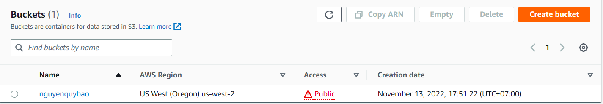
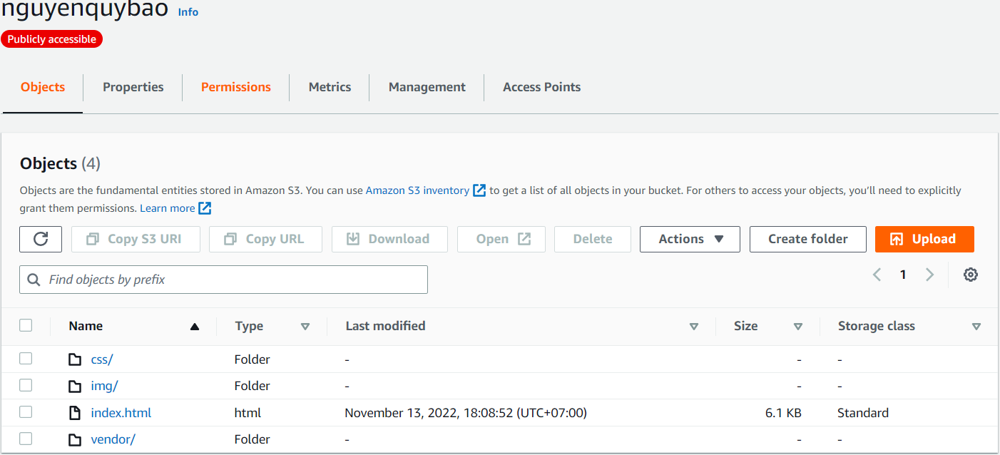
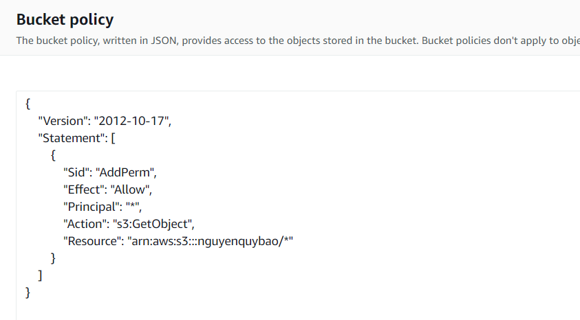
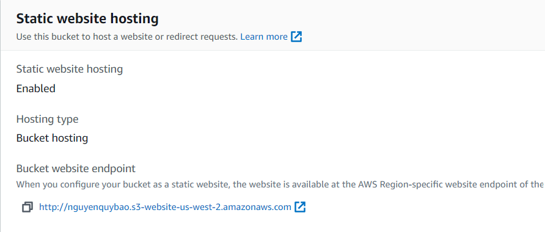
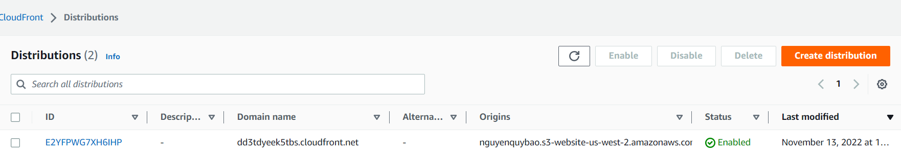

# Deploy Static Website using S3 and CloudFront

- Hosting a static website on S3
- Accessing the cached website pages using CloudFront for content delivery network (CDN) service.

Run this project
```
cd deploy
terraform init
terraform plan
terraform apply
```
# Access Website:
There are three ways to access this static website:
    
1. Access via CloundFront: [link](dd3tdyeek5tbs.cloudfront.net)
2. Access via website-endpoint : [link](http://nguyenquybao.s3-website-us-west-2.amazonaws.com/)
3. Access via S3 Object url: [link](https://nguyenquybao.s3.us-west-2.amazonaws.com/index.html)

# How did I do

1. With S3 bucket:
    - Create S3 bucket:

        

    - Upload static file 

        
    
    - Secure using IAM polices

        
    
    - Host a website using S3 endpoint

        
2. With CDN distribution using CloudFront:

    

